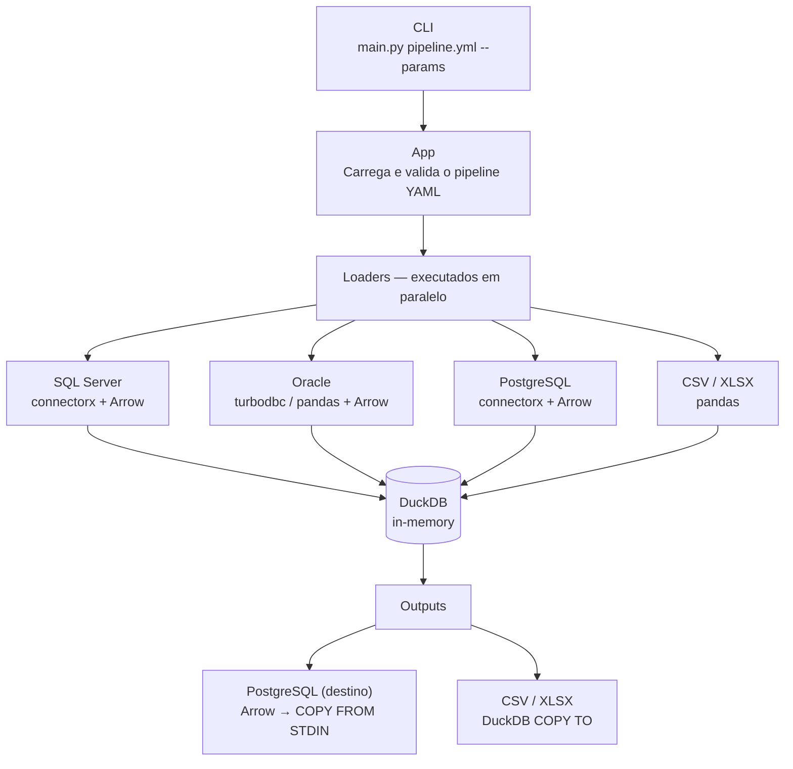

# OmniQuery

Ferramenta de ETL via YAML para consulta e processamento de dados entre múltiplas fontes. O OmniQuery usa **DuckDB** como motor intermediário em memória: carrega dados de origens diversas, transforma via SQL e exporta para diferentes destinos.

[](https://github.com/SrMarinho/Omniquery/actions/workflows/ci.yml)

## Como funciona



Cada pipeline YAML define:
1. **Loaders** — de onde buscar os dados e como nomeá-los no DuckDB
2. **Outputs** — queries SQL sobre as tabelas carregadas e para onde enviar o resultado

## Pré-requisitos

- Python 3.12+
- [uv](https://docs.astral.sh/uv/)
- Drivers conforme os bancos usados:
  - **SQL Server**: ODBC Driver 17 for SQL Server
  - **Oracle**: Oracle Instant Client + driver ODBC
  - **PostgreSQL**: libpq (geralmente já incluído)

## Instalação

```bash
git clone <repo-url>
cd omniquery
uv sync
```

## Configuração

### 1. Variáveis de ambiente (`.env`)

```bash
cp .env.example .env
```

Preencha as credenciais dos bancos e ajuste os parâmetros de tuning conforme necessário:

| Variável | Padrão | Descrição |
|---|---|---|
| `LOG_LEVEL` | `INFO` | Nível de log: `DEBUG`, `INFO`, `WARNING`, `ERROR` |
| `DB_CHUNK_SIZE` | `500000` | Linhas por chunk ao ler via pandas (Oracle fallback) |
| `DB_THREADS` | `4` | Threads do DuckDB |
| `DB_MEMORY_LIMIT` | `4GB` | Limite de memória do DuckDB |
| `PIPELINE_WORKERS` | `4` | Tabelas carregadas em paralelo por loader |
| `PG_WORK_MEM` | `256MB` | `work_mem` por sessão no PostgreSQL de destino |
| `PG_MAINTENANCE_WORK_MEM` | `1GB` | `maintenance_work_mem` por sessão no PostgreSQL |
| `ORACLE_ODBC_DRIVER` | `Oracle` | Nome do driver ODBC instalado para Oracle |

### 2. Conexões de banco (`databases.yml`)

Define as connection strings. As variáveis entre `{{ }}` são substituídas pelo `.env`:

```yaml
postgresql:
  connection_string: "postgresql://{{DATABASE_USER}}:{{DATABASE_PASSWORD}}@{{DATABASE_HOST}}:{{DATABASE_PORT}}/{{DATABASE_NAME}}"

procfit:
  connection_string: "mssql+pyodbc://{{PROCFIT_DATABASE_USER}}:{{PROCFIT_DATABASE_PASSWORD}}@{{PROCFIT_DATABASE_HOST}}/{{PROCFIT_DATABASE_NAME}}?driver=ODBC+Driver+17+for+SQL+Server"

senior:
  connection_string: "oracle+oracledb://{{SENIOR_DATABASE_USER}}:{{SENIOR_DATABASE_PASSWORD}}@{{SENIOR_DATABASE_HOST}}:{{SENIOR_DATABASE_PORT}}/{{SENIOR_DATABASE_NAME}}"
```

## Uso

```bash
# Listar pipelines disponíveis
uv run main.py list

# Executar um pipeline
uv run main.py pipelines/meu_pipeline.yml

# Executar com parâmetros dinâmicos
uv run main.py pipelines/relatorio.yml --data_inicio 2024-01-01 --data_fim 2024-12-31

# Ver os parâmetros aceitos por um pipeline
uv run main.py pipelines/relatorio.yml --help

# Validar o pipeline sem executar (dry-run)
uv run main.py pipelines/relatorio.yml --dry-run
```

## Escrevendo pipelines

Os pipelines ficam em `pipelines/`. A extensão [YAML (Red Hat)](https://marketplace.visualstudio.com/items?itemName=redhat.vscode-yaml) no VS Code ativa autocompletar e validação via `schemas/pipeline.schema.json`.

### Estrutura completa

```yaml
name: nome_do_pipeline
description: Descrição opcional

# Parâmetros aceitos pela CLI e substituídos no YAML via {{ nome }}
parameters:
  - name: data_inicio
    type: date              # string | integer | float | boolean | date
    required: true
    description: Data de início (YYYY-MM-DD)

  - name: data_fim
    type: date
    required: true
    description: Data de fim (YYYY-MM-DD)

# Fontes de dados — cada tabela vira uma view no DuckDB
loads:
  - type: database
    source: procfit         # Nome definido em databases.yml
    tables:
      - alias: vendas       # Como a tabela será chamada no DuckDB
        type: inline        # "inline" (SQL direto) ou "sql" (arquivo .sql)
        content: |
          SELECT * FROM PEDIDOS
          WHERE DATA >= '{{ data_inicio }}'
          AND DATA <= '{{ data_fim }}'

  - type: database
    source: senior
    tables:
      - alias: compras
        type: inline
        content: SELECT * FROM COMPRAS

  - type: file
    source: data/metas.csv  # CSV ou XLSX
    tables:
      - alias: metas

# Destinos — queries sobre as tabelas carregadas acima
outputs:
  - type: database
    name: relatorio_vendas  # Tabela criada no banco de destino
    output_database: postgresql
    query: |
      SELECT v.*, m.meta
      FROM vendas v
      LEFT JOIN metas m ON v.setor = m.setor
    options:
      if_exists: replace    # "replace" (padrão) ou "append"

  - type: file
    name: outputs/relatorio.xlsx  # Extensão define o formato: .csv ou .xlsx
    query: SELECT * FROM vendas
```

### Parâmetros dinâmicos

Parâmetros declarados em `parameters:` viram flags na CLI (`--nome_param`) e são substituídos no YAML via `{{ nome_param }}` antes da execução.

```bash
uv run main.py pipelines/relatorio.yml --data_inicio 2024-01-01 --data_fim 2024-12-31
```

### SQL em arquivo separado

Para queries longas, use `type: sql` e aponte para um arquivo `.sql`:

```yaml
tables:
  - alias: vendas
    type: sql
    content: queries/vendas.sql
```

## Internals de performance

O OmniQuery foi otimizado para transferências de alta volumetria:

| Caminho | Tecnologia | Quando |
|---|---|---|
| SQL Server / PostgreSQL → DuckDB | connectorx + Arrow (zero-copy) | Padrão para esses dialetos |
| Oracle → DuckDB | turbodbc + Arrow | Se turbodbc estiver instalado |
| Oracle → DuckDB | pandas + Arrow | Fallback automático |
| DuckDB → PostgreSQL | Arrow → BytesIO → `COPY FROM STDIN` | Sempre |
| DuckDB → CSV | `COPY TO` nativo do DuckDB | Sempre |

Tabelas de uma mesma fonte são carregadas em paralelo (controlado por `PIPELINE_WORKERS`).

Os logs de execução mostram rows/s e MB/s por tabela para facilitar diagnóstico:

```
procfit | nf_faturamento          998,621 rows  11.18s  89,295 r/s  12.0 MB/s
```

## Estrutura do projeto

```
omniquery/
├── cli/
│   └── commands.py              # Parser de argumentos com Rich — dinâmico por pipeline
├── pipelines/                   # Definições de pipelines YAML
├── schemas/
│   └── pipeline.schema.json     # JSON Schema para autocompletar no VS Code
├── scripts/
│   └── validate_pipelines.py    # Valida todos os pipelines contra o schema
├── tests/
│   ├── conftest.py              # Fixtures compartilhadas (minimal_pipeline_file)
│   ├── unit/                    # Testes unitários — sem banco externo
│   │   ├── test_app.py          # Testes de App._substitute_parameters
│   │   ├── test_entities.py     # Testes de entidades (Loader, Output, Pipeline, etc.)
│   │   └── test_utils.py        # Testes de utilitários
│   └── e2e/                     # Testes E2E com banco real (requer credenciais)
│       ├── conftest.py          # Fixtures, ResourceMonitor e utilitários E2E
│       ├── oracle_sim/          # Simulação de Oracle para testes sem banco real
│       ├── test_connections.py  # Conectividade com Procfit, PostgreSQL e Oracle
│       ├── test_loader_mssql.py # Loader SQL Server com dados reais
│       ├── test_oracle_sim.py   # Pipeline com Oracle simulado
│       ├── test_output_postgres.py      # Output PostgreSQL (sintético e real)
│       └── test_pipeline_divergencia.py # E2E pipeline de divergência PBS × Senior
├── src/
│   ├── app.py                   # Orquestrador principal
│   ├── exceptions.py            # Hierarquia de exceções
│   ├── config/
│   │   ├── database.py          # Instância global do DuckDB in-memory
│   │   ├── logging_config.py    # Configuração do Rich logging
│   │   └── settings.py          # Variáveis de ambiente e constantes
│   ├── entities/
│   │   ├── loader.py            # DatabaseLoader, FileLoader, LoaderFactory
│   │   ├── output.py            # DatabaseOutput, FileOutput, OutputFactory
│   │   ├── pipeline.py          # Modelo e orquestrador do pipeline
│   │   ├── parameter.py         # Modelo de parâmetro
│   │   └── table.py             # Modelo de tabela
│   └── utils/
│       ├── database_config_reader.py  # Leitor de databases.yml
│       └── retry.py                   # Retry com backoff exponencial
├── databases.yml                # Configuração de conexões
├── main.py                      # Entrypoint
└── pyproject.toml
```

## Desenvolvimento

```bash
# Instalar dependências de desenvolvimento
uv sync --group dev

# Rodar testes unitários
uv run pytest tests/unit/ -v

# Rodar testes E2E (requer credenciais no .env)
uv run pytest tests/e2e/ -v -s -m homolog

# Validar pipelines localmente
uv run python scripts/validate_pipelines.py

# Lint, format e tipos
uv run ruff check . --fix
uv run ruff format .
uv run mypy src/ cli/ main.py
```

### Pre-commit

```bash
uv run pre-commit install
```

Hooks: Ruff (lint + format), Mypy, trailing whitespace, end-of-file.

## Testes E2E

Os testes em `tests/e2e/` validam o pipeline contra bancos reais. São isolados do CI padrão e precisam de credenciais configuradas no `.env`.

```bash
# Rodar toda a suíte E2E
uv run pytest tests/e2e/ -v -s -m homolog

# Apenas os testes sem banco externo (Oracle simulado)
uv run pytest tests/e2e/ -v -s -k "not postgres and not mssql"
```

Os testes pulam automaticamente quando as credenciais do banco correspondente estão ausentes.

| Arquivo | Requer |
|---|---|
| `test_connections.py` | Procfit / PostgreSQL / Oracle |
| `test_loader_mssql.py` | Procfit (SQL Server) |
| `test_output_postgres.py` | PostgreSQL |
| `test_oracle_sim.py` | Nenhum (Oracle simulado via DuckDB) |
| `test_pipeline_divergencia.py` | Procfit + PostgreSQL (Oracle simulado ou real) |

### Flags úteis

| Flag | Padrão | Descrição |
|---|---|---|
| `--rows=N` | `500000` | Linhas sintéticas nos benchmarks de output |
| `--repeat=N` | `3` | Repetições por benchmark |

## CI/CD

| Workflow | Trigger | O que faz |
|---|---|---|
| **CI** | push / PR | Lint (Ruff), Mypy, testes unitários, validação de YAMLs |

## Tecnologias

| Biblioteca | Uso |
|---|---|
| [DuckDB](https://duckdb.org/) | Motor analítico in-memory |
| [connectorx](https://github.com/sfu-db/connector-x) | Leitura rápida SQL Server/PostgreSQL → Arrow |
| [PyArrow](https://arrow.apache.org/docs/python/) | Transferência zero-copy entre loaders e outputs |
| [SQLAlchemy](https://www.sqlalchemy.org/) | Conexão com bancos relacionais |
| [Pydantic](https://docs.pydantic.dev/) | Validação dos modelos de pipeline |
| [Pandas](https://pandas.pydata.org/) | Fallback para leitura chunked (Oracle) |
| [Rich](https://github.com/Textualize/rich) | CLI colorida e logging formatado |
| [Tenacity](https://tenacity.readthedocs.io/) | Retry com backoff exponencial |
| [uv](https://docs.astral.sh/uv/) | Gerenciador de pacotes |
| [Ruff](https://docs.astral.sh/ruff/) | Linter e formatador |
| [Mypy](https://mypy-lang.org/) | Verificação estática de tipos |
| [pytest](https://pytest.org/) | Framework de testes |
