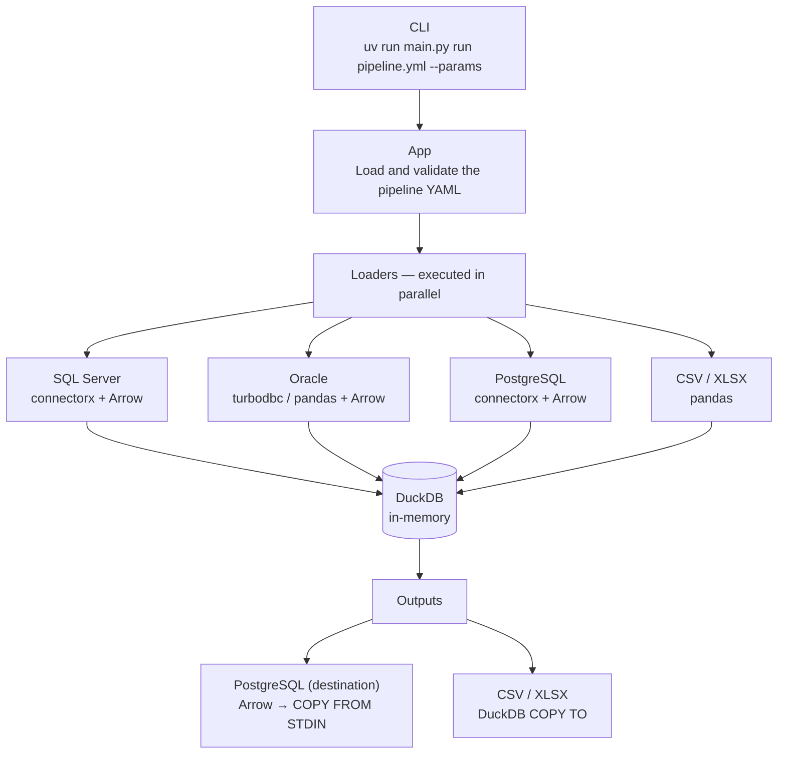

# OmniQuery

YAML-driven ETL tool. Uses **DuckDB** as an in-memory engine: load data from heterogeneous sources, transform via SQL, and export to multiple destinations.

[](https://github.com/SrMarinho/Omniquery/actions/workflows/ci.yml)

## How it works



## Quickstart

```bash
git clone <repo-url>
cd omniquery
uv sync
cp .env.example .env             # fill in credentials
uv run main.py list              # list available pipelines
uv run main.py run pipelines/my_pipeline.yml --start_date 2024-01-01 --end_date 2024-12-31
```

## Documentation

The full documentation lives under [`docs/`](docs/):

| Doc | Contents |
|---|---|
| [docs/getting-started.md](docs/getting-started.md) | Prerequisites, install, first run, CLI overview |
| [docs/configuration.md](docs/configuration.md) | `.env` variables, `databases.yaml`, env-var vs parameter substitution |
| [docs/permissions.md](docs/permissions.md) | Required DB permissions for sources and destinations |
| [docs/pipelines.md](docs/pipelines.md) | Writing pipelines: structure, loads, outputs, parameters, full field reference, worked example |
| [docs/architecture.md](docs/architecture.md) | Data flow, factories, in-memory DuckDB, Arrow paths, retry, exception hierarchy |
| [docs/project-structure.md](docs/project-structure.md) | Repository layout and file responsibilities |
| [docs/development.md](docs/development.md) | Dev setup, lint/format/types, pre-commit, commit conventions |
| [docs/testing.md](docs/testing.md) | Unit tests, E2E tests, Oracle simulation, useful flags |
| [docs/ci-cd.md](docs/ci-cd.md) | CI workflows |
